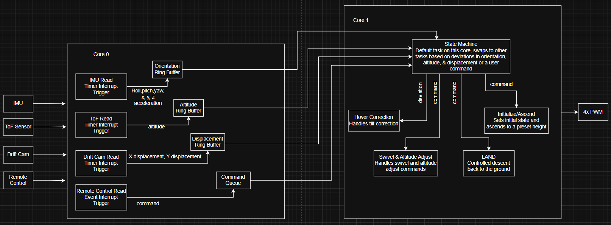
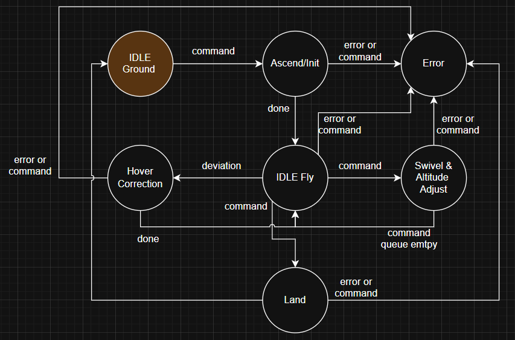

# BIRD E Flight Control

Drone flight controller firmware written for an RP2350a.

1. Contents

2. Software Block Diagram

2. State Machine on Core 1

3. Components List

- MCU: RP2350a
- Wifi & Video: Raspberry Pi Zero 2W
- IMU: MPU 9250 (used in testing for now)
- Laser ToF Sensor:
- Remote Control: SPI bridge to Zero 2W
- Drift Cam:

4. Datasheets

- [RP2350](https://datasheets.raspberrypi.com/rp2350/rp2350-datasheet.pdf)
- [PICO SDK](https://datasheets.raspberrypi.com/pico/raspberry-pi-pico-c-sdk.pdf)
- [MPU 9250 IMU](https://cdn.sparkfun.com/assets/learn_tutorials/5/5/0/MPU9250REV1.0.pdf)
